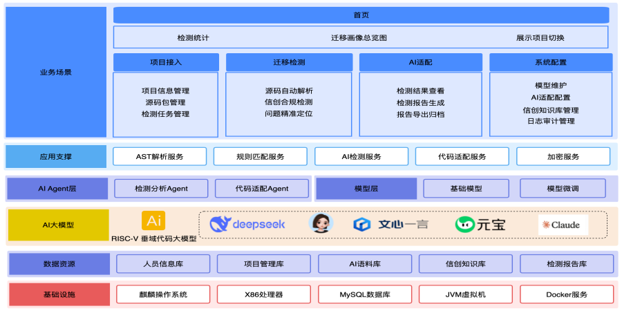
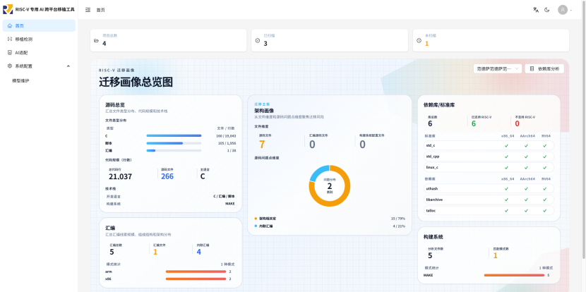
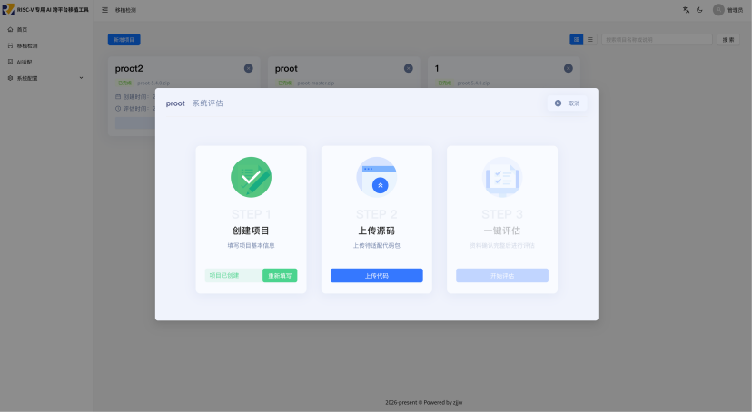
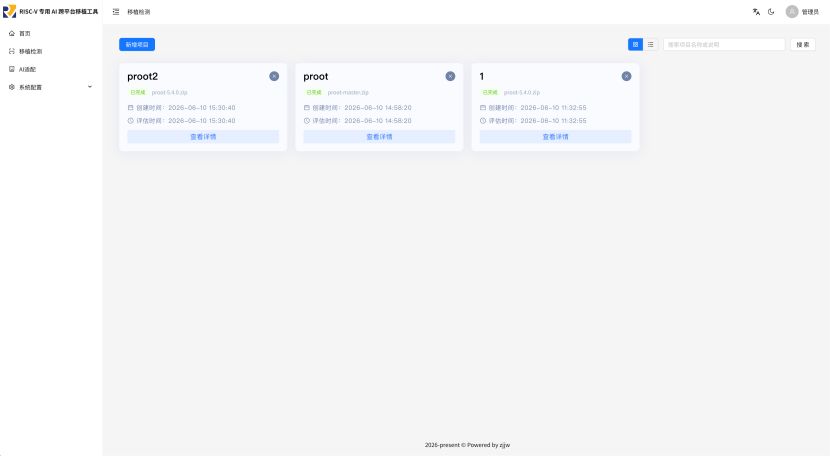
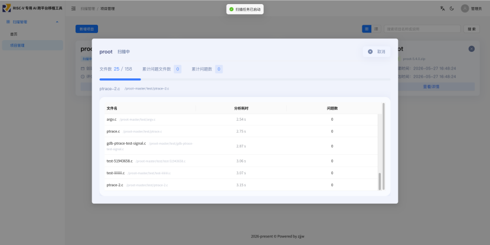
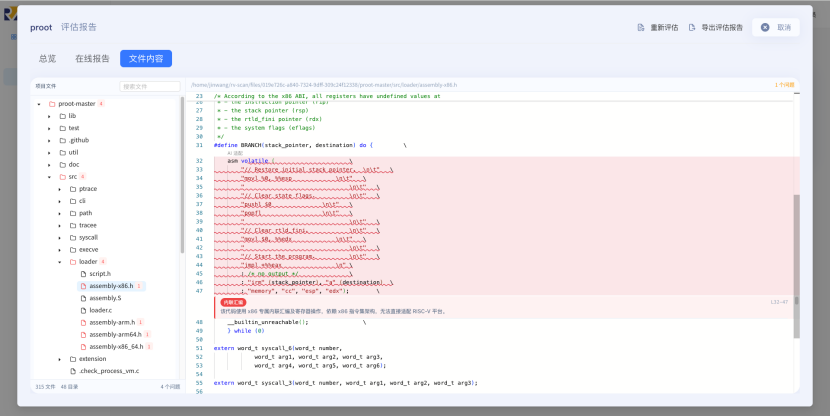
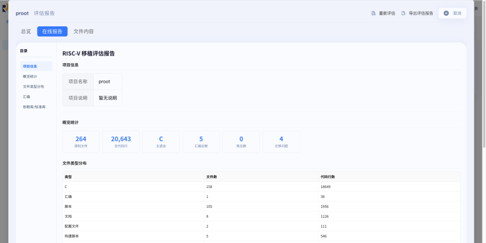
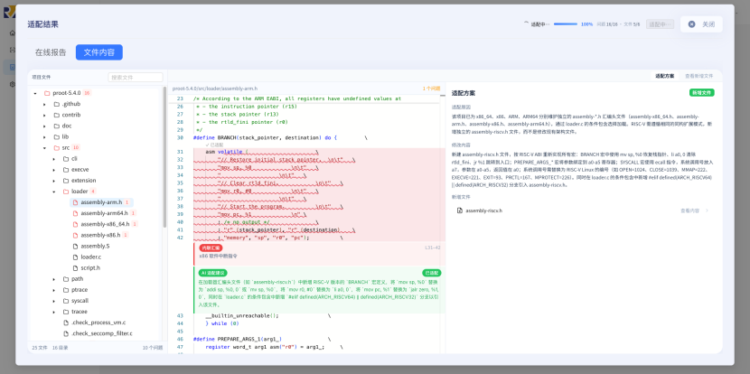
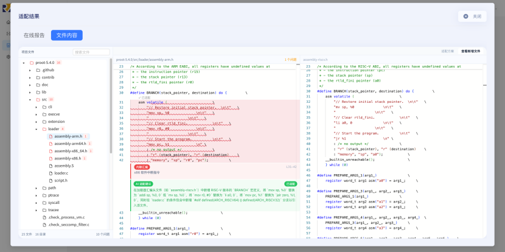
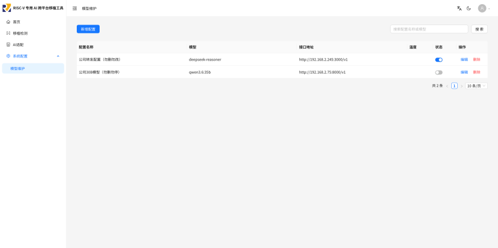

# RISC-V 专用 AI 跨平台移植工具

---

## 📋 项目简介

响应芯片产业国产化与多元化发展趋势，针对RISC-V架构在软件生态建设中面临的"跨架构代码移植"核心堵点，构建一个智能化、自动化的跨架构（X86/ARM到RISC-V）移植分析与移植建议工具。

---

## 🚀 环境要求

- JDK 21
- Node.js 20+
- MySQL 8.4+
- RabbitMQ 4.x

---

## 🏗️ 技术栈

| 层       | 技术                                                         |
| -------- | ------------------------------------------------------------ |
| 前端     | **Vue 3** + **Antdv Next**                             |
| 后端     | **SpringBoot3** + Java 21                              |
| 数据库   | **MySQL** 8.4                                          |
| 代码解析 | **tree-sitter**（多语言语法树解析）                    |
| 接口调用 | **retrofit-spring-boot-starter**（声明式 HTTP 客户端） |

---

## ⚡ 快速启动

### 1. 克隆项目

```bash
git clone https://github.com/rdi-bj/tongming-portkit
cd tongming-portkit
```

### 2. 基础中间件准备

启动项目依赖的中间件（MySQL / RabbitMQ）：

```bash
docker compose -f docker/docker-compose.middleware.yml up -d
```

- **MySQL**：数据库 `riscv_manage`，首次启动自动导入表结构与初始数据
- **RabbitMQ**：管理界面 `http://localhost:15672`，账号 `xc`

### 3. 后端启动（SpringBoot3）

#### 3.1 配置修改

配置位于 `backend/scan-launcher/src/main/resources/`，启动使用 `all` + `prod` 两个 profile，按环境修改：

- `spring.datasource`：MySQL 连接，`application-prod.yml` 中为 `localhost:3306/riscv_manage`，与第 2 步的 compose 一致
- `spring.rabbitmq`：RabbitMQ 连接，`application-prod.yml` 中为内网地址，本机运行需改为 `127.0.0.1`
- `cscan.file-path`：源码包与扫描产物的存放目录，需改为已存在且可写的路径（如 `~/rv-scan-files`）
- `server.port`：后端端口，默认 `9090`
- `opencode.url`：AI 适配所用的 opencode 服务地址，不在本仓库 compose 内，需自行提供

#### 3.2 启动后端（scan-launcher）

```bash
cd backend
mvn -pl scan-launcher -am package -DskipTests
java -jar scan-launcher/target/cscan.jar --spring.profiles.active=all,prod
```

> `all` 同时启用 Web 与 Worker，扫描任务经 RabbitMQ 在本进程内消费完成；也可在 IDE 中直接运行 `ScanApplication.java`，profile 设为 `all,prod`。

#### 3.3 单独启动 Worker（TODO）

Worker 侧（`scan-worker`）消费扫描任务队列，与 Web 侧通过 RabbitMQ 解耦，两侧对应的 profile 为 `worker` 与 `web`。

当前后端未按这两个 profile 正确隔离组件，单独启动 Worker 会因缺少 Servlet 容器而失败，暂请使用 3.2 的单进程方式（`all`）；后端修复后在此补充启动方式。

### 4. 前端启动（Vue3 + Vite）

#### 4.1 环境准备

- **Node.js 20+**
- 推荐使用 `pnpm`：`npm install -g pnpm`

#### 4.2 安装依赖

```bash
cd frontend
pnpm install
```

#### 4.3 配置后端代理

前端共 3 个变量，定义在 `frontend/.env`，各模式可用 `.env.development` 等覆盖；代理配置见 `frontend/vite.config.ts`：

- `VITE_APP_BASE_PATH`：部署基础路径，同时作为 Vite `base` 与路由 base，默认 `/tongming-portkit/`
- `VITE_API_BASE_PATH`：接口前缀，默认 `/tongming-portkit-api`，也是开发代理的键
- `VITE_API_BASE_URL`：后端源地址，仅开发代理的 target 使用，`.env.development` 中为 `http://127.0.0.1:9090`

#### 4.4 启动开发服务器

```bash
pnpm dev
```

浏览器访问 `http://localhost:5500/tongming-portkit/`。

### 5. 验证启动

- 前端登录页正常加载，默认账号 `jwAdmin` / `Portkit@123`，首次登录后请修改
- 进入「迁移检测」页面，上传源码包测试快速扫描
- 观察后端日志，确认任务经 RabbitMQ 成功分发至 Worker 执行

### 📌 常见问题

- **端口冲突**：后端端口改 `application-all.yml` / `application-web.yml` / `application-docker.yml` 里的 `server.port`（默认 9090），并同步前端 `.env.development` 的后端源地址 `VITE_API_BASE_URL`；前端自身端口在 `frontend/vite.config.ts` 的 `server.port`。
- **RabbitMQ 连接失败**：检查当前 profile 的 `spring.rabbitmq`，确认 RabbitMQ 服务已启动且账号密码一致。
- **AI 适配无响应**：确认 `opencode.url` 指向的 opencode 服务可达，并检查后端日志中的模型调用报错。

---

## 📁 项目结构

项目采用 **前后端分离** 架构，后端基于 SpringBoot3 构建：**Web 侧**负责任务调度与管理，**Worker 侧**负责消费任务并执行代码扫描/适配，两侧通过 **RabbitMQ** 进行任务发布与通信。

### 后端结构

```
backend/
├── scan-launcher/                   # 启动模块：Web 与 Worker 的统一启动入口
│   ├── src/main/java/com/jinw/ScanApplication.java
│   └── src/main/resources/
│       ├── application.yml            # 主配置
│       ├── application-prod.yml       # 生产环境
│       ├── application-web.yml        # Web 相关配置
│       ├── application-worker.yml     # Worker 相关配置
│       ├── application-docker.yml     # Docker 部署配置
│       ├── application-corpus.yml     # 语料库配置
│       └── application-all.yml        # 全量聚合配置
├── scan-worker/                     # Worker 侧：消费任务并执行代码扫描/适配
│   └── src/main/java/com/jinw/worker/
│       ├── config/                    # 配置
│       ├── consumer/                  # RabbitMQ 任务消费者
│       ├── ast/                       # AST 语法树解析（c/cpp）
│       ├── llm/                       # 大模型接入（agent、config、utils）
│       ├── task/                      # 任务跟踪与回收
│       ├── util/                      # 工具类
│       └── log/                       # 日志
├── scan-common/                     # 公共模块（domain、constant、enums、utils）
├── scan-mq/                         # 消息队列模块（RabbitMQ 发布/订阅）
├── scan-web/                        # Web 接口模块（controller、service、mapper）
└── scan-corpus/                     # 语料库模块（RISC-V 知识库）
```

### 前端结构

```
frontend/
├── src/                         # 前端源码（Vue 3 + TS + Vite）
│   ├── api/                     # 接口层（对应后端 scan-web 的 HTTP 调用侧）
│   │   ├── scan.ts              # Scanner 接口：项目 CRUD、启动扫描、进度/文件树/报告
│   │   ├── llm.ts               # LLM 接口：模型配置、文件/项目级适配、适配结果、项目树
│   │   └── auth.ts              # 认证接口（OSS 开源版 /sys/user/login）
│   ├── components/              # 组件层
│   │   ├── scan/                # ★ 扫描业务组件
│   │   │   ├── ScanProgressDialog.vue    # 检测进度弹窗（解压/扫描/AI 复核逐文件状态）
│   │   │   ├── ScanReportDialog.vue      # 在线检测报告弹窗（与离线导出报告格式对齐）
│   │   │   ├── AtlasPanel.vue            # 迁移画像面板（ECharts：语言/汇编/依赖/构建）
│   │   │   └── HomePageAtlas.vue         # 首页画像（拉取画像数据并组织 AtlasPanel）
│   │   ├── light/               # 轻量通用组件（LightButton/Card/Descriptions/Dialog/Link/Tabs）
│   │   ├── internal/            # 框架内部组件（Logo、主题/语言/折叠开关、UI Provider、配置面板、图标渲染）
│   │   └── GraphCanvas.vue      # 自研 Canvas 函数调用/依赖关系图
│   ├── composables/             # 逻辑编排层（对应后端 scan-mq 的消费侧）
│   │   ├── useScanWebSocket.ts      # 单任务扫描进度 WS（心跳15s+指数退避重连）
│   │   ├── useScanListProgressWs.ts # 列表页多任务进度 WS（替代 HTTP 轮询）
│   │   ├── useTypewriter.ts         # 打字机效果（适配方案一次性显示后保留）
│   │   ├── useAtlasData.ts          # 迁移画像数据聚合/视觉色调
│   │   └── useGraphScene.ts         # 关系图 Three.js 场景
│   ├── pages/                   # 页面层（文件路由自动生成，definePage 声明元数据）
│   │   ├── dashboard/index.vue  # 首页/迁移画像总览
│   │   ├── scan/projects.vue    # ★ 迁移检测（项目列表/卡片、快速/深度扫描入口）
│   │   ├── llm/adapt/index.vue  # ★ AI 适配（项目/文件级适配、适配后代码查看）
│   │   ├── system/models/       # 大模型配置管理
│   │   ├── login/               # 登录页（OSS 开源版）
│   │   ├── error/               # 403/404 错误页
│   │   └── [...path].vue        # 404 兜底路由
│   ├── layouts/                 # 布局壳（default=管理后台，pure=登录等纯净页）
│   ├── layout-blocks/           # 布局预设块（top/side/mix）
│   ├── layout-components/       # 布局组成件（header/sider/menu/breadcrumb/content/footer）
│   ├── stores/                  # 状态层（Pinia：app 应用配置、user 用户/权限、routes 路由）
│   ├── hooks/                   # 通用 hooks（useECharts：ECharts 实例生命周期）
│   ├── utils/                   # 基础设施（对应后端 scan-common）
│   │   ├── scan-request.ts      # Scanner 专用 alova 实例 + 文件下载（blob/Content-Disposition）
│   │   ├── auth-storage.ts      # token 存取、记住密码
│   │   ├── element.ts           # 无头 DOM 效果（文件上传/下载）
│   │   └── event-bus.ts         # 事件总线（mitt 实例）
│   ├── lib/                     # 图数据与共享底层（edgesDataLoader、forceSimulation、graphData、scanSocket）
│   ├── constants/               # 常量（app 配置、regex 正则）
│   ├── types/                   # 领域类型（对应后端 domain）：scan/llm/api/pages/app/router...
│   │   └── generated/           # 自动生成（auto-imports、components、typed-router）
│   ├── theme/                   # 主题（light/dark 色板）
│   ├── styles/                  # 全局样式（global、atlas、view-transition）
│   ├── plugins/                 # 应用装配（对应后端 application-*.yml 聚合配置）
│   │   ├── index.ts             # 装配入口：store→权限→i18n→router
│   │   ├── router.ts / i18n.ts / store.ts / progress-bar.ts
│   │   └── echarts.ts           # ECharts 注册（Bar/Line/Pie + Canvas 渲染器）
│   ├── config.default.ts        # 默认应用配置 AppConfig
│   └── main.ts                  # 应用入口
├── build/                       # Vite 构建配置模块（index 组装插件/postcss/路径解析）
├── locales/                     # 国际化（zh-CN / en-US）
├── scripts/                     # 辅助脚本
│   └── find-i18n-leaks.mjs      # i18n key 泄漏检查
├── public/                      # 静态资源（favicon、_redirects）
└── 根配置                        # 相当于后端各 application.yml
    ├── vite.config.ts           # 主配置：base、接口前缀代理、别名、构建
    ├── uno.config.ts            # UnoCSS 原子化样式
    ├── tsconfig*.json           # TS 工程配置
    ├── eslint/stylelint/prettier
    └── .env / .env.development / .env.test / .env.production
```

### 任务通信机制

Web 侧通过 RabbitMQ 发布扫描/适配任务，Worker 侧消费任务执行分析后返回结果。

---

## 🔧 核心功能

### 一、智能移植检测与迁移画像

上传源码包一键启动检测，自动生成可视化"迁移画像"报告，精准评估移植风险与改造路线：

| 模式               | 说明                                                       |
| ------------------ | ---------------------------------------------------------- |
| **快速检测** | 一键启动，快速响应，适用于初步评估                         |
| **深度检测** | 全量覆盖所有静态分析发现的问题，适用于对准确度要求高的场景 |

**检测流程：** 项目信息填写 → 源码包上传 → 源码 AST 解析 → 知识库匹配 → RISC-V 问题记录 → AI 复核 → 报告生成

### 二、AI 驱动的代码适配建议

AI 自动判断适配场景，基于垂域大模型生成精准适配策略，分为三个核心场景：

#### 场景一：原位修改

AI 直接在原文件中修改不兼容代码，通过条件编译等手段保留多架构兼容。适用于通用逻辑适配场景。

#### 场景二：新增架构文件

AI 识别现有架构文件模式，自动新建 `riscv_impl.c` 等独立文件，保持项目结构一致。适用于已有 X86/ARM 实现的项目。

#### 场景三：服务器配置描述

AI 自动生成服务器配置描述文件，涵盖编译选项、依赖库、运行时参数等关键信息。适用于基础设施/部署适配场景。

---

## 🏛️ 系统架构



### 技术创新点

#### 技术创新一：代码拆分技术

通过智能代码拆分，将大型项目分解为可管理的子任务单元，结合知识库特征精准匹配，实现从开源项目到 RISC-V 适配的全流程自动化语料采集。

#### 技术创新二：AI Agent 驱动的自动化流程

传统人工模式依赖专家经验，流程易中断、效率低、成本高。本工具采用AI Agent实现从代码分析到适配的端到端自动化闭环，大幅缩短移植周期。

---

## 🖼️ 软件使用截图

以下截图展示了工具的核心界面与功能流程。

### 首页



### 检测准备



### 检测列表



### 检测进度



### 检测问题查看



### 在线报告



### AI 适配过程



### AI 适配结果



### 模型维护



## 许可证

`tongming-portkit` 版权归 **北京瑞偲创新科技产业有限公司** 所有，基于 **木兰宽松许可证第 2 版（Mulan PSL v2）** 开源。

- 许可证全文：http://license.coscl.org.cn/MulanPSL2
- SPDX 标识：`MulanPSL-2.0`
